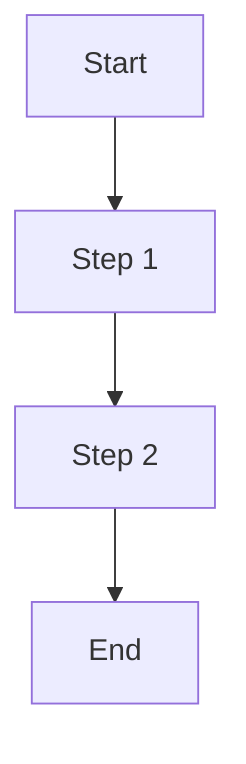

# Templates

Templates define document formats for PRD generation, step refinement, and output presentation. They use Handlebars-style syntax for variable interpolation.

## Overview

Templates are rendered at key points in the workflow execution:

```
┌─────────────────────────────────────────────────────────────┐
│  1. INTENTION TRIGGERED                                     │
│     Questions asked, answers gathered                       │
│                                                             │
│  2. PRD GENERATION ← templates/prd.md                       │
│     Implementation plan shown to user                       │
│     [Approve] [Edit] [Cancel]                               │
│                                                             │
│  3. WORKFLOW EXECUTION                                      │
│     For each step with refinePrd: true                      │
│       ↳ STEP PRD ← templates/step-prd.md                    │
│                                                             │
│  4. COMPLETION ← templates/output.md                        │
│     Results summary shown to user                           │
└─────────────────────────────────────────────────────────────┘
```

## Directory Structure

```
.agentx/templates/
├── prd.md              # Intention-level PRD template
├── step-prd.md         # Step-level PRD template
├── output.md           # Completion summary template
└── README.md
```

---

## Template Files

### prd.md

Generated after intention questions are answered. Presents the implementation plan for user approval.

```markdown
<!-- .agentx/templates/prd.md -->

# Implementation PRD: {{intention.name}}

## Goal

{{intention.goal}}

## User Request

{{userPrompt}}

## Requirements

{{#each answers}}
### {{this.question}}
{{this.answer}}
{{/each}}

## Execution Plan

{{#each workflow.steps}}
### Step {{@index}}: {{this.name}}
{{this.description}}

**Skills:** {{#each this.skills}}{{this}}{{#unless @last}}, {{/unless}}{{/each}}

{{#if this.refinePrd}}
⚠️ *This step will request additional details before execution.*
{{/if}}
{{/each}}

## Expected Outputs

{{#each workflow.outputs}}
- `{{this}}`
{{/each}}

## Estimated Duration

~{{estimatedDuration}} minutes

---

*Review the plan above. Click **Approve** to proceed, **Edit** to modify, or **Cancel** to abort.*
```

### step-prd.md

Generated for steps with `refinePrd: true`. Provides detailed specification before complex step execution.

```markdown
<!-- .agentx/templates/step-prd.md -->

# Step PRD: {{step.name}}

## Objective

{{step.description}}

## Context

**Workflow:** {{workflow.name}}
**Step:** {{step.id}} ({{@stepIndex}} of {{workflow.steps.length}})

## Inputs

{{#each step.inputs}}
| Input | Value |
|-------|-------|
| `{{this}}` | {{lookup ../context this}} |
{{/each}}

## Additional Requirements

{{#each stepAnswers}}
### {{this.question}}
{{this.answer}}
{{/each}}

## Previous Step Outputs

{{#if previousOutputs}}
{{#each previousOutputs}}
- **{{@key}}:** {{this}}
{{/each}}
{{else}}
*This is the first step.*
{{/if}}

## Acceptance Criteria

{{#if step.acceptanceCriteria}}
{{#each step.acceptanceCriteria}}
- [ ] {{this}}
{{/each}}
{{else}}
- [ ] Step completes without errors
- [ ] Expected outputs are generated
- [ ] Output matches requirements
{{/if}}

---

*Review the step specification. Click **Execute** to proceed or **Skip** to bypass this step.*
```

### output.md

Rendered after workflow completes. Summarizes results and created files.

```markdown
<!-- .agentx/templates/output.md -->

# ✅ Workflow Complete: {{workflow.name}}

## Summary

**Intention:** {{intention.name}}
**Duration:** {{duration}}
**Steps Completed:** {{completedSteps}} of {{totalSteps}}

## Created Files

{{#each createdFiles}}
- [`{{this.path}}`]({{this.uri}})
{{/each}}

## Modified Files

{{#if modifiedFiles}}
{{#each modifiedFiles}}
- [`{{this.path}}`]({{this.uri}})
{{/each}}
{{else}}
*No existing files were modified.*
{{/if}}

## Step Results

{{#each steps}}
### {{#if this.success}}✅{{else}}❌{{/if}} {{this.name}}

{{#if this.success}}
{{#if this.outputs}}
**Outputs:**
{{#each this.outputs}}
- `{{@key}}`: {{this}}
{{/each}}
{{/if}}
{{else}}
**Error:** {{this.error}}
{{/if}}

{{/each}}

## Next Steps

{{#if suggestedNextSteps}}
{{#each suggestedNextSteps}}
1. {{this}}
{{/each}}
{{else}}
- Review generated files
- Run tests to verify implementation
- Commit changes to version control
{{/if}}

---

*Workflow execution complete. Files are ready for review.*
```

---

## Template Syntax

Templates use Handlebars-style syntax for dynamic content.

### Variables

```handlebars
{{variableName}}
{{nested.property}}
{{object.array.0.field}}
```

### Conditionals

```handlebars
{{#if condition}}
  Content shown if truthy
{{else}}
  Content shown if falsy
{{/if}}

{{#unless condition}}
  Content shown if falsy
{{/unless}}
```

### Iteration

```handlebars
{{#each arrayOrObject}}
  {{this}}              <!-- Current item -->
  {{@index}}            <!-- Array index (0-based) -->
  {{@key}}              <!-- Object key -->
  {{@first}}            <!-- Boolean: first item? -->
  {{@last}}             <!-- Boolean: last item? -->
{{/each}}
```

### Helpers

```handlebars
{{#unless @last}}, {{/unless}}     <!-- Comma-separate except last -->
{{lookup object key}}               <!-- Dynamic property access -->
{{join array ", "}}                 <!-- Join array with separator -->
{{uppercase text}}                  <!-- Transform to uppercase -->
{{lowercase text}}                  <!-- Transform to lowercase -->
{{dateFormat date "YYYY-MM-DD"}}    <!-- Format date -->
{{json object}}                     <!-- Output as JSON -->
{{markdown text}}                   <!-- Render as markdown -->
```

### Comments

```handlebars
{{!-- This is a comment and won't render --}}
```

### Escaping

```handlebars
{{variableName}}      <!-- HTML escaped -->
{{{rawHtml}}}         <!-- Unescaped (use carefully) -->
\{{escaped}}          <!-- Literal: {{escaped}} -->
```

---

## Available Context

### prd.md Context

| Variable | Type | Description |
|----------|------|-------------|
| `intention.id` | string | Intention identifier |
| `intention.name` | string | Intention display name |
| `intention.goal` | string | Intention goal description |
| `userPrompt` | string | User's original prompt |
| `answers` | array | Question answers `[{question, answer}]` |
| `workflow.id` | string | Workflow identifier |
| `workflow.name` | string | Workflow display name |
| `workflow.steps` | array | Workflow steps |
| `workflow.outputs` | array | Expected output names |
| `estimatedDuration` | number | Estimated minutes |
| `persona.id` | string | Active persona id |
| `persona.name` | string | Active persona name |
| `alias.id` | string | Active alias id |
| `alias.name` | string | Active alias name |

### step-prd.md Context

| Variable | Type | Description |
|----------|------|-------------|
| `step.id` | string | Step identifier |
| `step.name` | string | Step display name |
| `step.description` | string | Step description |
| `step.skills` | array | Skills used by step |
| `step.inputs` | array | Required input names |
| `step.outputs` | array | Expected output definitions |
| `step.acceptanceCriteria` | array | Acceptance criteria |
| `stepAnswers` | array | Step PRD question answers |
| `previousOutputs` | object | Outputs from previous steps |
| `context` | object | Full workflow context |
| `workflow.*` | object | Parent workflow info |
| `@stepIndex` | number | Current step index (1-based) |

### output.md Context

| Variable | Type | Description |
|----------|------|-------------|
| `workflow.id` | string | Workflow identifier |
| `workflow.name` | string | Workflow display name |
| `intention.id` | string | Intention identifier |
| `intention.name` | string | Intention display name |
| `duration` | string | Formatted duration (e.g., "2m 34s") |
| `completedSteps` | number | Steps completed successfully |
| `totalSteps` | number | Total steps in workflow |
| `createdFiles` | array | Files created `[{path, uri}]` |
| `modifiedFiles` | array | Files modified `[{path, uri}]` |
| `steps` | array | Step results `[{name, success, outputs, error}]` |
| `suggestedNextSteps` | array | Suggested follow-up actions |
| `context` | object | Final workflow context |

---

## Custom Templates

### Per-Intention Templates

Override templates for specific intentions:

```yaml
# .agentx/intentions/add-api-endpoint.yaml
id: add-api-endpoint
name: Add API Endpoint
goal: Create a new REST API endpoint

templates:
  prd: templates/api-endpoint-prd.md      # Custom PRD template
  output: templates/api-endpoint-output.md
```

### Per-Step Templates

Override step PRD template for specific steps:

```yaml
# .agentx/workflows/spring-crud-endpoint.yaml
steps:
  - id: generate-migration
    name: Generate Migration
    refinePrd: true
    prdTemplate: templates/migration-step-prd.md  # Custom step template
```

### Template Location

Templates are resolved in order:

1. Step-specific: `step.prdTemplate`
2. Intention-specific: `intention.templates.*`
3. Default: `.agentx/templates/*.md`

---

## Examples

### Minimal PRD Template

```markdown
<!-- .agentx/templates/prd.md -->

# {{intention.name}}

{{intention.goal}}

## Plan

{{#each workflow.steps}}
{{@index}}. {{this.name}}
{{/each}}

---

[Approve] [Cancel]
```

### Detailed PRD Template

```markdown
<!-- .agentx/templates/prd.md -->

# 📋 Implementation PRD

## Overview

| Field | Value |
|-------|-------|
| **Intention** | {{intention.name}} |
| **Persona** | {{persona.name}} |
| **Context** | {{alias.name}} |
| **Workflow** | {{workflow.name}} |

## User Request

> {{userPrompt}}

## Gathered Requirements

{{#each answers}}
<details>
<summary><strong>{{this.question}}</strong></summary>

{{this.answer}}

</details>
{{/each}}

## Execution Plan

```mermaid
graph TD
{{#each workflow.steps}}
    {{#if @first}}START([Start]){{/if}}
    {{this.id}}[{{this.name}}]
    {{#if @first}}START --> {{this.id}}{{/if}}
    {{#unless @last}}{{this.id}} --> {{lookup (lookup ../workflow.steps (sum @index 1)) 'id'}}{{/unless}}
    {{#if @last}}{{this.id}} --> END([Complete]){{/if}}
{{/each}}
```

{{#each workflow.steps}}
### Step {{sum @index 1}}: {{this.name}}

{{this.description}}

| Aspect | Detail |
|--------|--------|
| **Skills** | {{#each this.skills}}`{{this}}`{{#unless @last}}, {{/unless}}{{/each}} |
| **Refinement** | {{#if this.refinePrd}}Yes{{else}}No{{/if}} |

{{/each}}

## Outputs

{{#each workflow.outputs}}
- `{{this}}`
{{/each}}

## Risk Assessment

{{#if hasHighRiskSteps}}
⚠️ **Warning:** This workflow includes steps that modify existing files or external systems.
{{else}}
✅ This workflow only creates new files.
{{/if}}

---

**Estimated Duration:** ~{{estimatedDuration}} minutes

Ready to proceed?
```

### API-Specific Output Template

```markdown
<!-- .agentx/templates/api-endpoint-output.md -->

# ✅ API Endpoint Created

## Endpoint Details

| Aspect | Value |
|--------|-------|
| **Entity** | {{context.entityName}} |
| **Base Path** | `/api/{{lowercase context.entityName}}s` |
| **Package** | {{context.basePackage}} |

## REST Endpoints

| Method | Path | Description |
|--------|------|-------------|
| GET | `/api/{{lowercase context.entityName}}s` | List all |
| GET | `/api/{{lowercase context.entityName}}s/{id}` | Get by ID |
| POST | `/api/{{lowercase context.entityName}}s` | Create new |
| PUT | `/api/{{lowercase context.entityName}}s/{id}` | Update |
| DELETE | `/api/{{lowercase context.entityName}}s/{id}` | Delete |

## Created Files

{{#each createdFiles}}
### {{this.path}}

```
{{this.path}}
```

{{/each}}

## Test the Endpoint

```bash
# Create
curl -X POST http://localhost:8080/api/{{lowercase context.entityName}}s \
  -H "Content-Type: application/json" \
  -d '{"name": "Test"}'

# List
curl http://localhost:8080/api/{{lowercase context.entityName}}s

# Get by ID
curl http://localhost:8080/api/{{lowercase context.entityName}}s/1
```

## Next Steps

1. Review generated code in your IDE
2. Run `mvn test` to verify
3. Start the application and test endpoints
4. Add business validation as needed
```

---

## Formatting Tips

### Tables

```markdown
| Column 1 | Column 2 |
|----------|----------|
| {{value1}} | {{value2}} |
```

### Code Blocks

````markdown
```java
{{code}}
```
````

### Collapsible Sections

```markdown
<details>
<summary>Click to expand</summary>

{{content}}

</details>
```

### Badges/Status

```markdown
{{#if success}}✅{{else}}❌{{/if}} {{name}}
```

### Links

```markdown
[{{file.name}}]({{file.uri}})
```

### Mermaid Diagrams

````markdown

````

---

## Best Practices

### Keep PRDs Scannable

```markdown
<!-- ✓ Good - easy to scan -->
## Plan
1. Generate entity
2. Create migration
3. Add repository
4. Add service
5. Add controller

<!-- ✗ Bad - wall of text -->
First we will generate the entity class, then we will create a migration,
after which we will add a repository, followed by a service, and finally
a controller...
```

### Show Context

```markdown
<!-- ✓ Good - clear context -->
**Entity:** {{context.entityName}}
**Package:** {{context.basePackage}}
**Fields:** {{join context.fields ", "}}

<!-- ✗ Bad - missing context -->
Creating the requested items...
```

### Include Actionable Items

```markdown
<!-- ✓ Good - clear next steps -->
## Next Steps
1. Run `mvn test` to verify
2. Review generated code
3. Commit changes

<!-- ✗ Bad - vague -->
## Next Steps
Do the usual stuff.
```

### Handle Empty States

```markdown
{{#if items}}
{{#each items}}
- {{this}}
{{/each}}
{{else}}
*No items to display.*
{{/if}}
```

### Use Consistent Formatting

```markdown
<!-- ✓ Good - consistent style -->
## Step 1: Generate Entity
## Step 2: Create Migration
## Step 3: Add Repository

<!-- ✗ Bad - inconsistent -->
## Step 1 - Generate Entity
## Create Migration
## 3. Add Repository
```

---

## Troubleshooting

### Variable not rendering

```
{{variableName}} shows as literal text
```

1. Check variable exists in context
2. Verify spelling matches exactly (case-sensitive)
3. Check for typos in `{{` or `}}`

### Conditional not working

```
{{#if condition}} not evaluating correctly
```

1. Check condition variable is actually boolean or truthy/falsy
2. Empty arrays `[]` are falsy in Handlebars
3. Use `{{#if variable.length}}` for arrays

### Each loop empty

```
{{#each items}} produces nothing
```

1. Verify `items` is an array
2. Check array is not empty
3. Use `{{else}}` to handle empty case

### Escaping issues

```
HTML entities appearing in output
```

1. Use `{{{variable}}}` for raw HTML (triple braces)
2. Use `\{{literal}}` for literal mustaches

### Template not found

```
Error: Template not found: templates/custom.md
```

1. Verify file exists at specified path
2. Check path is relative to `.agentx/`
3. Ensure `.md` extension is included

---

## Validation Checklist

| Aspect | Check |
|--------|-------|
| **Syntax** | All `{{` have matching `}}` |
| **Blocks** | All `{{#if}}` have `{{/if}}` |
| **Loops** | All `{{#each}}` have `{{/each}}` |
| **Variables** | Variables match available context |
| **Markdown** | Valid markdown syntax |
| **Rendering** | Test with sample data |
